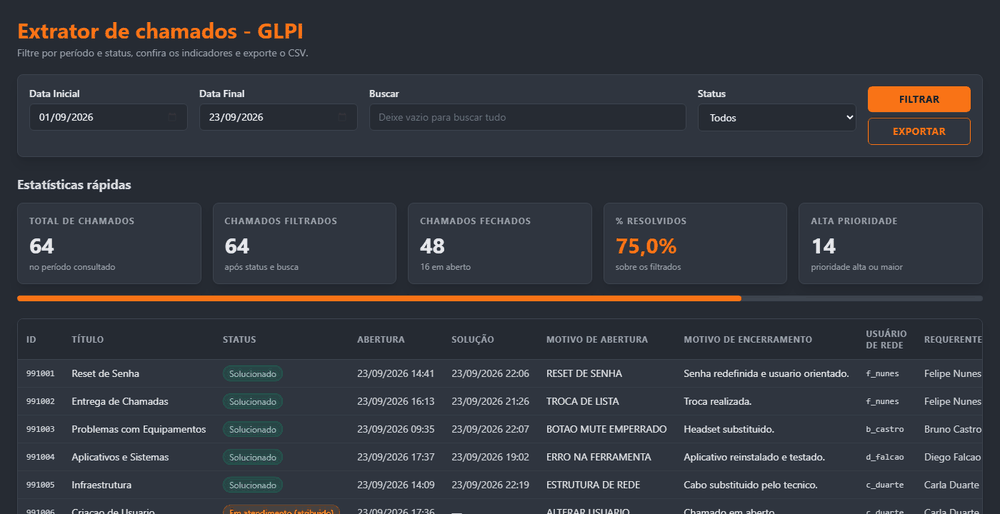
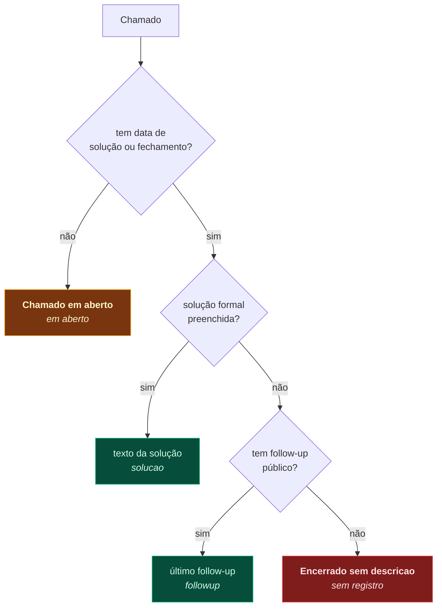
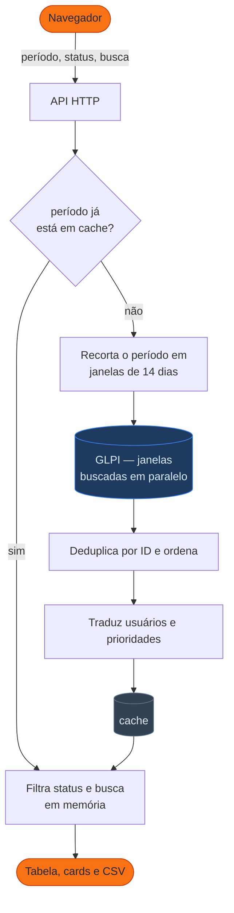

# Extrator de chamados — GLPI

Serviço web que consulta os chamados do GLPI pela API REST, mostra os
indicadores do período e exporta um CSV organizado por data de abertura, data
de solução, **motivo de abertura** e **motivo de encerramento**.

Go no back-end, React + Tailwind no front, um binário único servido apenas em
HTTPS, com as credenciais lidas exclusivamente do `.env`.




<sub>Filtro por status, busca textual e exportação — gravado com dados fictícios.</sub>

---

## Índice

- [O problema](#o-problema)
- [Como o extrator resolve](#como-o-extrator-resolve)
- [Começando](#começando)
- [Configuração](#configuração)
- [O CSV](#o-csv)
- [API](#api)
- [Desempenho](#desempenho)
- [Testes](#testes)
- [Estrutura do projeto](#estrutura-do-projeto)
- [Deploy](#deploy)
- [Dados sensíveis](#dados-sensíveis)

## O problema

O GLPI guarda o que interessa em lugares que o relatório nativo não alcança:

| O que se quer saber | Onde está no GLPI |
| --- | --- |
| Por que o chamado foi aberto | Dentro do texto do formulário, como `9) SOLICITAÇÃO : ERRO NA FERRAMENTA` |
| Por que foi encerrado | Na solução formal ou, na maioria das vezes, no último follow-up |
| Quem é o usuário afetado | No campo `USUÁRIO DE REDE` do formulário — nem sempre é quem abriu |
| Percentual de resolvidos | Não existe pronto |

O extrator lê tudo isso e entrega em uma tabela e em um CSV que o Excel abre
sem assistente de importação.

## Como o extrator resolve

**Somente leitura.** Nenhuma chamada altera dados no GLPI.

**Motivo de abertura.** Os chamados nascem de formulários cujo corpo é uma
lista numerada. O extrator extrai esses campos e usa o primeiro rótulo listado
em `MOTIVO_ABERTURA_LABELS`. Sem nenhum deles, cai para a categoria do GLPI e,
por último, para o título. A coluna `Origem do motivo` registra de onde veio —
em produção, cerca de 95% vêm do formulário.

**Motivo de encerramento.** Procurado em cascata: solução formal → último
follow-up **público** → marcação explícita. Na prática **metade dos chamados é
encerrada sem preencher a solução**, e o desfecho fica no follow-up
("Normalizado.", "Acessos modificados, reinicie e teste"). É o "follow que
entra na categoria de solução" descrito no SDD. Solução e follow-ups vêm
embutidos na própria busca, sem uma requisição por chamado.

Follow-ups **privados** ficam de fora de propósito: são notas internas da
equipe e acabariam em um CSV que circula fora dela.



Distribuição real em um mês de produção (4.815 chamados): **48%** vieram da
solução formal, **42%** do follow-up, 8% seguiam em aberto e 3% não tinham
registro nenhum. Sem a etapa do follow-up, quase metade do relatório sairia
sem motivo de encerramento.

**Resolvido** é decidido pela data de solução ou fechamento, não pelo rótulo de
status — assim o cálculo não quebra se o GLPI estiver em outro idioma.

**Usuário de rede** é o login alvo do chamado, lido do formulário. Não é o
requerente: quem abre costuma ser o supervisor, e o chamado trata do login de
outra pessoa.

**Nomes e rótulos.** A busca devolve requerente, técnico e prioridade como IDs
numéricos, mesmo com `expand_dropdowns`. O extrator traduz: prioridade por
tabela e usuários por um cadastro carregado uma vez a cada 30 minutos.

### O caminho de uma consulta



O período é o **único** filtro enviado ao GLPI. Status e busca textual são
aplicados sobre o resultado em memória — por isso refiltrar e exportar não
repetem a varredura.

## Começando

### Com Docker

```bash
cp .env.example .env          # preencha as credenciais do GLPI
go run ./cmd/gerarcert -saida ./certs -host localhost,127.0.0.1
docker compose up --build
```

Abra **https://localhost:8443** (com `https://` explícito — o serviço não fala
HTTP). O certificado autoassinado gera um aviso na primeira visita.

### Sem Docker

```bash
cd web && npm ci && npm run build && cd ..   # gera web/dist, embutido no binário
go build -o extrator ./cmd/extrator
./extrator                                   # lê ./.env; use -env para outro caminho
```

Para desenvolver o front com recarga automática, `cd web && npm run dev` sobe o
Vite em `http://localhost:5173` com proxy de `/api` para o back-end.

## Configuração

Tudo vem do `.env`. **As variáveis do GLPI e do TLS não têm valor padrão**:
faltando qualquer uma, o serviço não sobe e diz qual falta.

### Obrigatórias

| Variável | Para que serve |
| --- | --- |
| `GLPI_URL` | Raiz do GLPI. O `/apirest.php` é acrescentado sozinho |
| `GLPI_APP_TOKEN` | App-Token do cliente da API (Configurar → Geral → API) |
| `GLPI_USUARIO` / `GLPI_SENHA` | Usuário de serviço com leitura nos chamados |
| `TLS_CERT_FILE` / `TLS_KEY_FILE` | Certificado e chave do HTTPS |

> O GLPI casa o App-Token com o cliente da API **cuja faixa de IPv4 cobre quem
> chamou**. De um IP fora da faixa, o token correto é reportado como inválido
> (`ERROR_WRONG_APP_TOKEN_PARAMETER`). Ao mudar de máquina, ajuste o
> *Intervalo de IPv4* do cliente.

### Opcionais

| Variável | Padrão | Para que serve |
| --- | --- | --- |
| `SERVER_PORT` | `8443` | Porta HTTPS |
| `GLPI_VERIFY_SSL` | `true` | `false` quando o GLPI usa CA interna |
| `MOTIVO_ABERTURA_LABELS` | `SOLICITACAO,PROBLEMA,ATENDIMENTO,MOTIVO` | Rótulos do formulário usados como motivo, em ordem de prioridade |
| `USUARIO_REDE_LABELS` | `USUARIO DE REDE,LOGIN DE REDE,USUARIO,LOGIN,USER` | Rótulos que contêm o login alvo |
| `CACHE_TTL` | `5m` | Validade do cache. Períodos passados não mudam: vale `30m` ou mais |
| `AQUECER_CACHE` | `true` | Mantém o mês corrente pronto, em segundo plano. Custo fixo de uma varredura por ciclo |
| `MAX_CHAMADOS` | `5000` | Teto por consulta. Ao atingir, a tela avisa que o período foi truncado |
| `TEMPO_MAXIMO_CONSULTA` | `10m` | Tempo máximo de uma consulta antes de desistir |
| `GLPI_PARALELISMO` | `16` | Consultas simultâneas. Subir acelera e pressiona mais o GLPI |
| `GLPI_LOTE_BUSCA` | `1000` | Chamados por página. Se o GLPI recusar, o serviço reduz sozinho |
| `LOG_LEVEL` | `info` | `debug`, `info`, `warn`, `error` |

## O CSV

UTF-8 com BOM e separador `;` — o Excel em pt-BR abre direto. Valores que
começam com `=`, `+`, `-` ou `@` são neutralizados contra injeção de fórmula.

```
ID; Título; Status; Data de abertura; Hora de abertura; Data de solução;
Hora de solução; Atendimento; Motivo de abertura; Origem do motivo;
Motivo de encerramento; Origem do encerramento; Usuário de rede;
Requerente; Técnico; Categoria; Prioridade; Entidade
```

Data e hora vão em células separadas: assim a planilha agrupa por dia sem
precisar de fórmula, e a hora fica livre para virar faixa de horário.

**Atendimento** é o tempo entre a abertura e a solução, em `HH:MM` — e o total
não vira dia: um chamado de três dias sai como `72:15`, não `00:15`. É o
formato que o Excel soma e faz média com a máscara `[h]:mm`. Chamado em aberto
fica com a célula **vazia**, de propósito: um zero entraria na média como se o
atendimento tivesse sido instantâneo.

## API

| Rota | Descrição |
| --- | --- |
| `GET /api/chamados` | Página de chamados + indicadores |
| `GET /api/export.csv` | Mesmos filtros, sem paginação |
| `GET /api/health` | Estado da sessão com o GLPI |

Parâmetros: `inicio` e `fim` (`AAAA-MM-DD`), `status`
(`todos`/`resolvidos`/`abertos`), `q`, `pagina`, `por_pagina` e `atualizar=1`
para ignorar o cache.

Erro de parâmetro volta `400`; falha ou recusa do GLPI volta `502`, com a
mensagem original do GLPI e uma dica do que costuma causá-la.

## Desempenho

Medido contra um GLPI com ~200 chamados por dia, primeira consulta sem cache:

| Período | Chamados | Primeira consulta | Depois |
| --- | --- | --- | --- |
| 1 mês | 4.968 | ~23 s | instantâneo |
| 3 meses | 18.643 | ~83 s | instantâneo |
| 6 meses | 37.508 | ~6 min | instantâneo |

Com `AQUECER_CACHE` ligado, o mês corrente — que é o que a tela abre — já está
pronto quando alguém acessa.

Três decisões sustentam esses números:

- **Solução e follow-ups vêm na própria busca**, não em uma requisição por
  chamado. Isso derrubou as consultas individuais de 2.150 para 42 em um mês.
- **O período é recortado em janelas de 14 dias**, buscadas em paralelo. Não é
  só velocidade: o GLPI devolve HTTP 500 quando o deslocamento da busca passa
  de ~14 mil chamados, porque a consulta é um `OFFSET` sobre vários `JOIN`s.
- **Degradação em vez de falha.** Se o GLPI recusar um lote, o serviço espera e
  tenta de novo, depois reduz o tamanho e, em último caso, refaz a faixa sem os
  campos de follow-up — basta um chamado com uma thread de e-mail colada
  inteira para estourar a memória do PHP e derrubar a página toda.

O limite não é o extrator, é o GLPI. Uma varredura longa concorre com quem está
usando o sistema; para aliviar, baixe `GLPI_PARALELISMO`.

## Testes

```bash
go test ./...
```

Cobrem o parser dos formulários (com casos tirados de chamados reais), a
leitura das respostas do GLPI, a cascata solução → follow-up e o descarte dos
privados, a extração do usuário de rede, a paginação paralela com
deduplicação, a degradação em erro do servidor, o cache, o aquecimento e a
geração do CSV.

## Estrutura do projeto

```
cmd/extrator      binário do serviço (TLS, encerramento limpo, -healthcheck)
cmd/gerarcert     certificado autoassinado para desenvolvimento
internal/config   leitura estrita do .env
internal/glpi     cliente da API, parsers, filtros e estatísticas
internal/api      rotas HTTP, CSV, aquecimento de cache e middlewares
internal/cache    cache com TTL das consultas
web               front-end React + Tailwind (embutido via go:embed)
deploy            pacote de instalação em servidor (imagem, compose, runbook)
```

## Deploy

O diretório [`deploy/`](deploy/) traz um pacote fechado — imagem, compose,
certificado e um script que verifica porta e Docker antes de instalar. Passo a
passo em [deploy/RUNBOOK.md](deploy/RUNBOOK.md).

```bash
cd /tmp && tar xzf extratorglpi-deploy.tar.gz
cd extratorglpi-deploy && sudo bash instalar.sh
```

## Dados sensíveis

**O CSV pode conter senhas em texto claro.** Chamados de reset costumam
registrar a senha temporária no follow-up público ou na própria solução, e é
dali que sai a coluna "Motivo de encerramento". Follow-ups privados são
descartados, mas os públicos não têm como ser filtrados sem perder o motivo
real do encerramento.

O arquivo exportado também traz nomes de colaboradores e logins de rede. Trate
como documento interno.
